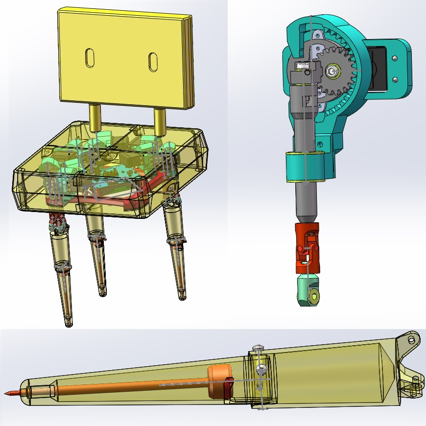
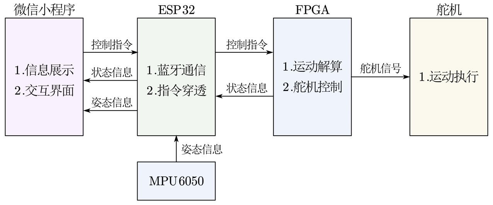
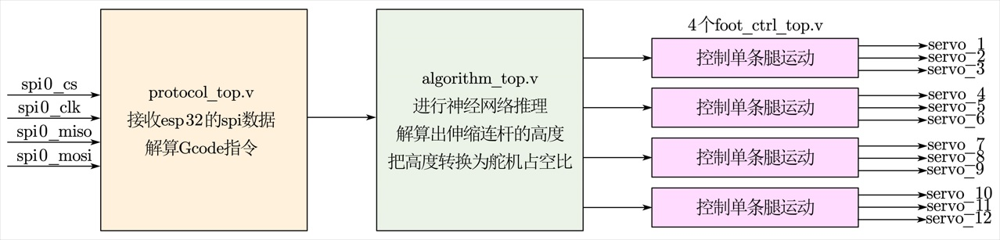
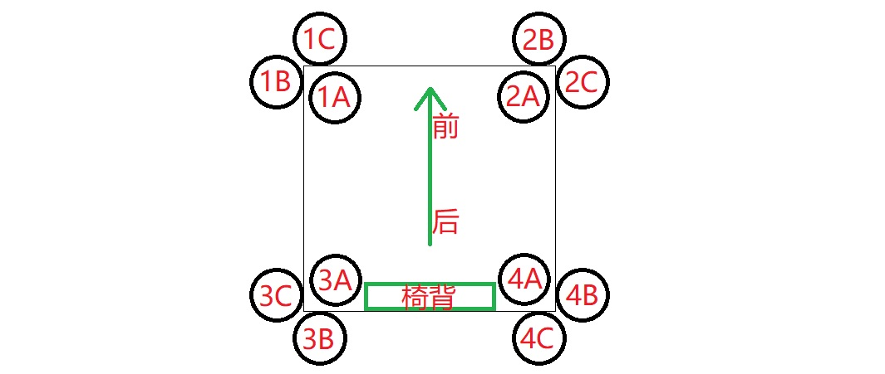

# CaotaiSystem

### 介绍
一只会走路、会跳舞、会写字的草太椅子

### 文件内容

##### 1_结构

这个文件夹里放了草太椅子机械结构相关的文件
1.  `草太椅子`文件夹是椅子主体，使用SOLIDWORKS Premium 2021 SP5.0绘制，考虑到Solidworks向下兼容，所以应该使用同版本或更高版本打开
2.  `鞋子`文件夹放了三种鞋子，如果是走路功能，则使用`鞋子-前脚`和`鞋子-后脚`，如果是写字功能和跳舞功能，则换用`后脚-稳定站立`，因为稳定站立版本不容易前倾，所以摔倒风险会小一些，但是走路时难以向前移动重心
3.  `单轴往复运动STL`放了单轴往复子装配体的STL文件，可用于3D打印切片
4.  除了3D打印件以外，还要购买舵机、滑动轴承、肩轴螺丝等标准件，`草太结构标准件BOM.xlsx`是物料清单

##### 2_电路

这个文件夹里放了电路板相关的文件
1.  `ProProject_caotai_ctrl_v2.epro`是嘉立创EDA pro另存为本地的工程文件，嘉立创EDA挺好用的，我已经从Cadence转到国产EDA了。打开步骤如下：     
（1）进入https://lceda.cn/ ，微信扫码登录     
（2）依次点开嘉立创EDA 编辑器 专业版，进入在线编辑器界面     
（3）点击文件->导入->嘉立创EDA专业版，在弹出的文件选择窗口选择`ProProject_caotai_ctrl_v2.epro`     
（4）等待导入完成，1分钟左右     
（5）在弹出的导入窗口中点击保存按钮，即可导入完成     
（6）点开PCB1，屏幕右上角有个类似购物车的图标，点击可以进入打样，下单之前别忘了领取1-4层板沉金免费券
2.  `草太控制板-电子元器件BOM.xlsx`是物料清单，都是正确的，大胆购买吧
3.  舵机不是纯阻性器件，会产生过冲电流，二极管`D2`和`D3`是瞬态抑制二极管，焊接时不可省略它们（血泪教训）

##### 3_算法

这个文件夹里放了算法相关的代码，是用了2个相互独立的全连接神经网络     
已知我们的草太椅子有4条腿，每条腿有3个伸缩连杆，我们算法的目的是解算出某个单腿姿态下3只伸缩连杆的高度，因为针对单条腿进行解算，没有把4条腿都联结起来，所以动作会有些生硬(T.T)     
第一个神经网络是2-64-64-2的结构，输入的2个神经元分别代表草太腿的外倾角和旋转角，输出的2个神经元分别代表伸缩连杆B、C和伸缩连杆A的高度之差     
第二个神经网络是3-64-64-64-3的结构，输入的3个神经元分别代表草太脚尖的x/y/z轴坐标，输出的3个神经元分别代表3只伸缩连杆的高度
1.  `dataset_angle.m`和`dataset_draw.m`分别用于生成上述两个神经网络的数据集，数据集是通过解方程组产生的，核心代码在`function_forward.m`里面
2.  `train_angle.ipynb`和`train_draw.ipynb`是训练这两个神经网络的代码，用到了`Tensorflow`框架
3.  `eval_angle.m`和`eval_draw.m`用于评估这两个神经网络的精度，包括浮点精度和在FPGA实现时的定点精度
4.  `make_para_rom.m`、`make_h2t_rom.m`和`make_sin_rom.m`用于FPGA实现时生成相关的查找表文件

##### 4_FPGA

这个文件夹里放了FPGA的工程，使用安路FPGA`TD4.6.4`进行开发

##### 5_esp32_Arduino

这个文件夹里放了esp32的代码，主要完成2个功能：a.把从蓝牙收到的指令透传给FPGA；b.读取`mpu6050`的姿态
1.  使用`VS code`作为开发环境，`Arduino`作为框架来开发esp32
2.  在`PIO Home`新建工程，板卡选择`Espressif ESP32 Dev Module`，框架选择`Arduino`
3.  在`PIO Home`搜索`mpu6050`，在搜索到的库中选择`I2Cdevlib-MPU6050 by Jeff Rowberg`，add to project
4.  把本文件夹里的`main.cpp`作为工程的主函数编译、下载即可

##### 6_微信小程序

草太椅子采用微信小程序作为上位机来进行控制，有3种方法打开
1.  微信首页搜索`上仙的蓝牙法器`即可在搜索的小程序结果中找到对应小程序
2.  扫描上面的小程序码可以进入小程序，我这个小程序已经走完备案、认证、隐私合规流程了哦，很厉害很合法哦
3.  把代码下载到本地，然后使用`微信开发者工具`自行编译，使用`真机调试`功能即可体验小程序

### 复刻说明

##### 如果你想完全复刻

1.  如果你想复刻这把椅子，建议从`单轴往复装配体`开始，该装配体实现了单轴的直线运动     
（1）采用了多处`滑动轴承`+`肩轴螺丝`+`M2.5螺母`的设计，安装时一只手用尖嘴钳夹紧`M2.5螺母`，另一只手用六角匙拧`肩轴螺丝`，注意拧得太紧会导致无法运动，拧得太松会导致公差过大，拧到连接处可以转动但又不会乱晃为止     
（2）安装舵机时，应把舵机调整到90°状态，必须把内齿轮安装在整个伸缩连杆行程的中间位置     
（3）3D打印时`伸缩连杆`卧倒打印，这样会使打印的层纹平行于连杆，从而增加结构强度，如果强度太弱会导致和万向节连接处发生断裂
2.  接下来是制作`草太的腿`装配体，把`新的小腿`、`大腿`、`腿的按钮`、`0.5*6*25弹簧`、`花枝俏毛笔`组装在一起
3.  `单轴往复装配体`和`草太的腿`调试完成后，把`十二轴连接器`打印出来，安装在一起，构成草太椅子的主体

4.  电路板打样，esp32和FPGA程序烧录，把舵机出线插在电路板上，插线定义参见上图
5.  打印`椅子的顶面`、`椅子的底面`和`椅背`，这三个零件边长30cm左右，如果你的打印机没有这么大，可以把它切分成4块分别打印，然后用螺丝紧固在一起，把上述零件组装在一起，至此结构和电路部分完成
6.  校正！这是最重要的一步，因为即使同一家购买的同一批生产的舵机也难以做到完全一致，所以安装完成后需要手动校正，包括2个层面的校正     
（1）第一个层面是舵机级别的校正，通过不断调整[caotai_top.v](4_FPGA/caotai_v1_0_TangPrimer_EG4S20BG256/rtl/caotai_top.v)第99~110行BIAS参数，最终实现草太上电时4只脚都完全垂直于底面     
（2）第二个层面是整机级别的校正，通过调整微信小程序控制页面的`行走功能超参数`和`跳舞功能超参数`，最终实现草太可以稳定走路和跳舞而不摔倒
7.  最后，enjoy it!

##### 如果你想不完全复刻

1.  虽然完全按照本仓库的代码和图纸复刻出来这把草太椅子很有趣，但可能不适合所有人，甚至会因为我本人水平有限而限制到复刻者的发挥
2.  所以复刻者可以充分发挥自己的能力，对本设计进行魔改，从而提升性能，我目前能想到的有以下几个方向：     
（1）结构方面，把电机改为步进电机，替换掉模拟舵机，模拟舵机的精度太差了     
（2）算法方面，把4条腿联动起来进行运动解算，从而使动作更加自然     
（3）算法方面，把mpu6050的姿态数据用于保持平衡，从而增加稳定性（目前已经可以把数据读出来并上传到小程序，但是没有进行处理）     
（4）电路和FPGA方面，替换掉已经停产的[Tang Primer](https://wiki.sipeed.com/hardware/zh/tang/Tang-primer/index.html)，使用在产的其他FPGA核心板，比如载有高云FPGA的[Tang Primer 20K](https://wiki.sipeed.com/hardware/zh/tang/tang-primer-20k/primer-20k.html)，注意核心板替换了以后PCB也要重新绘制哦     
（5）校正流程方面，目前进行舵机层面的校正时，每次都要修改`caotai_top.v`再重新编译下载FPGA固件，这太麻烦了，所以可以通过增加通信协议指令来在线校正     
（6）其他我没有想到的方向...
3.  至少你得把`单轴往复装配体`复刻出来，它的直线运动很有趣，不信问问你的女朋友

##### 如果你不想复刻

1.  esp32和微信小程序采用蓝牙进行交互的部分，目前已经调试稳定，可以成为其他设计的参考
2.  去B站对应视频下面给我点个一键三连吧

### 参考引用

1.  内摆线实现旋转运动转直线运动的原理参考了[这个视频](https://www.bilibili.com/video/BV1mZ4y1f7oy/)
2.  esp32和微信小程序通过蓝牙进行通信参考了[这个视频](https://www.bilibili.com/video/BV1oq4y1q7sC/)

